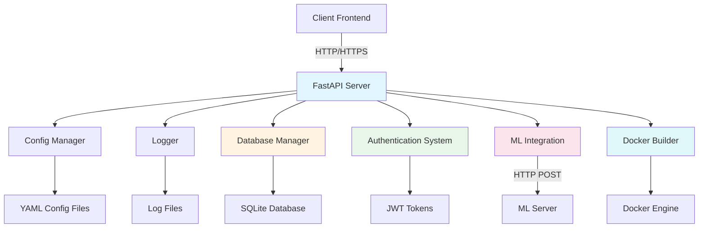
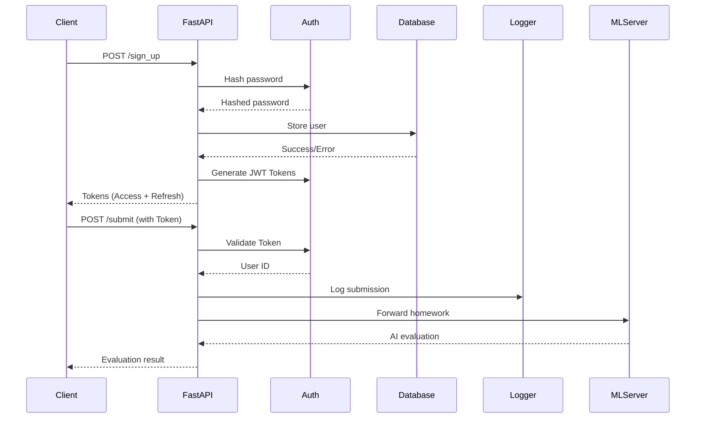

# Архитектура проекта: Backend для проверки домашних заданий

## 1. Обзор проекта

Проект представляет собой FastAPI backend-сервер для системы автоматической проверки домашних заданий с использованием искусственного интеллекта. Сервер обрабатывает регистрацию и авторизацию пользователей, принимает домашние задания и взаимодействует с ML-сервером для их проверки.

### Ключевые характеристики
- **Целевая платформа**: Кроссплатформенное решение (Linux, macOS, Windows)
- **Фреймворк**: FastAPI с асинхронной обработкой запросов
- **База данных**: SQLite для хранения пользовательских данных
- **Интеграция**: REST API взаимодействие с ML-сервером
- **Безопасность**: JWT (JSON Web Tokens) для аутентификации, SHA-256 хеширование паролей
- **Режим работы**: REST API сервер с CORS поддержкой

---

## 2. Архитектура системы

### 2.1. Общая схема компонентов



### 2.2. Поток обработки запросов



### 2.3. Компоненты системы

#### 2.3.1. Server (`src/core/server.py`)
**Назначение**: Основной FastAPI сервер приложения.

**Ответственности:**
- Инициализация FastAPI приложения
- Настройка CORS middleware
- Регистрация HTTP обработчиков
- Управление жизненным циклом сервера
- Координация работы всех компонентов

#### 2.3.2. Database Manager (`src/core/database_manager.py`)
**Назначение**: Управление базой данных пользователей.

**Ответственности:**
- Создание и управление SQLite соединением
- CRUD операции с пользователями
- Хеширование паролей перед сохранением
- Управление сессиями пользователей (хранение токенов)

#### 2.3.3. Authentication System (`src/security/`)
**Назначение**: Безопасность и аутентификация.

**Ответственности:**
- Генерация и валидация JWT токенов (`encryptors.py`)
- Middleware для проверки токенов (`auth_middleware.py`)
- Хеширование паролей (SHA-256)

#### 2.3.4. ML Integration (`src/core/server.py` + `src/core/prompts.py`)
**Назначение**: Взаимодействие с ML-сервером.

**Ответственности:**
- Формирование промптов для AI
- Отправка запросов на ML-сервер
- Обработка ответов от ML-сервера

#### 2.3.5. Docker Builder (`src/docker_builder/`)
**Назначение**: Сборка Flutter Web приложений.

**Ответственности:**
- Создание Docker образов для сборки
- Запуск сборки Flutter проектов в контейнерах
- Управление жизненным циклом контейнеров

---

## 3. Структура проекта

```
Backend/
├── configs/                # Конфигурационные файлы
├── data/                   # Данные (БД)
├── logs/                   # Логи
├── ML/                     # ML сервер (LLaMA Local)
├── src/                    # Исходный код Backend
│   ├── core/               # Ядро (сервер, конфиг, БД)
│   ├── docker_builder/     # Сборщик Docker контейнеров
│   ├── models/             # Pydantic модели
│   ├── security/           # Аутентификация и безопасность
│   ├── services/           # Бизнес-логика
│   └── utils/              # Утилиты
├── tests/                  # Тесты
├── run_server.py           # Скрипт запуска
└── requirements.txt        # Зависимости
```

---

## 4. API Эндпоинты

| Метод | Путь | Описание | Аутентификация |
|-------|------|----------|----------------|
| GET | `/health` | Проверка здоровья сервера | Нет |
| GET | `/info` | Информация о сервере | Нет |
| POST | `/log` | Запись сообщения в лог | Нет |
| POST | `/sign_up` | Регистрация пользователя | Нет |
| POST | `/sign_in` | Авторизация пользователя | Нет |
| POST | `/logout` | Выход из системы | Да |
| GET | `/me` | Профиль пользователя | Да |
| POST | `/submit` | Отправка домашнего задания | Да |

---

## 5. Безопасность

### 5.1. Аутентификация
Используется схема Bearer Token с JWT.
- **Access Token**: Короткоживущий токен для доступа к ресурсам.
- **Refresh Token**: Долгоживущий токен для обновления Access Token.

### 5.2. Хранение паролей
Пароли хранятся в хешированном виде (SHA-256).
*Планируется переход на BCrypt.*

---

## 6. ML Сервер

ML сервер (`ML/`) представляет собой отдельное приложение на FastAPI, которое запускает локальные LLM модели (через `llama-cpp-python`).
Он предоставляет API для генерации текста и кода.

---

## 7. Развертывание

### 7.1. Локальный запуск
```bash
python run_server.py
```

### 7.2. Docker
Проект содержит Dockerfile для сборки и запуска в контейнере.