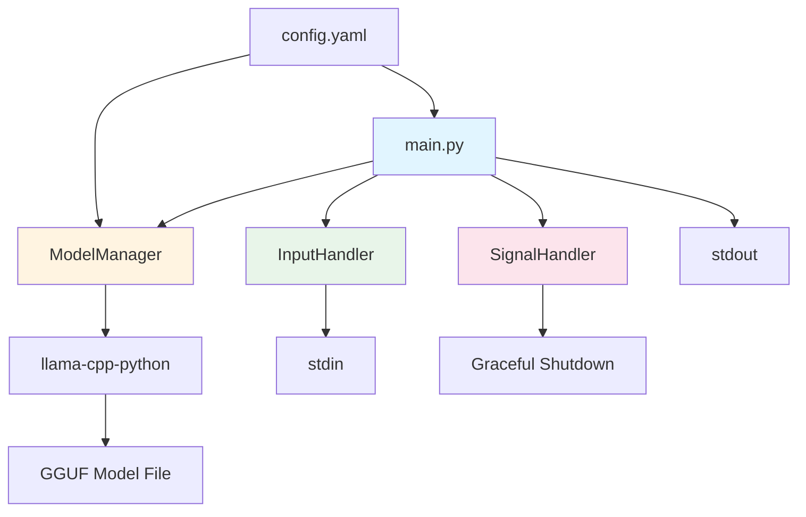
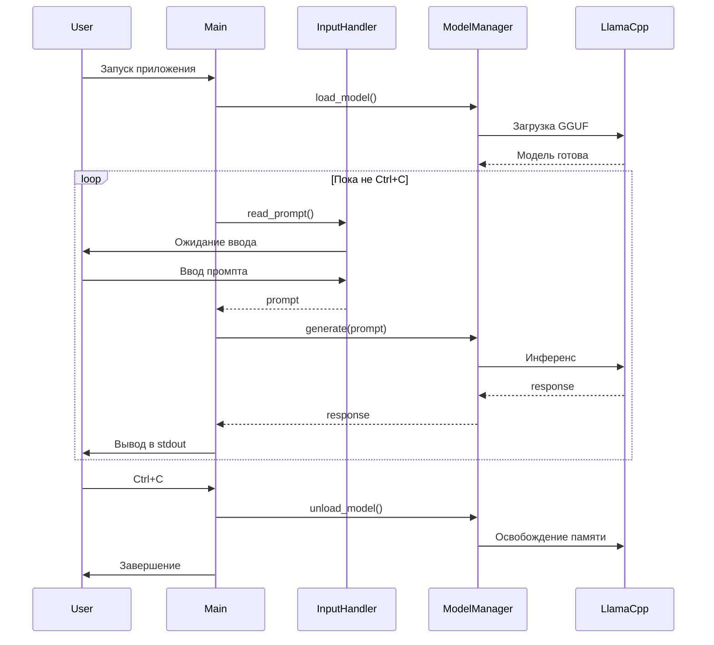

# Архитектура проекта: Локальный LLaMA Runner для MacOS

## 1. Обзор проекта

Проект представляет собой консольное приложение для запуска квантизированных моделей LLaMA 3.2 (1B/3B) на MacOS с оптимизацией под Apple Silicon. Приложение работает в режиме простого Q&A: читает промпты из stdin, обрабатывает их через локальную модель и выводит результаты в stdout.

### Ключевые характеристики
- **Целевая платформа**: MacOS (Apple Silicon M1/M2/M3)
- **Модели**: LLaMA 3.2 1B/3B (квантизированные)
- **Режим работы**: Простой Q&A без сохранения контекста
- **Интерфейс**: CLI (stdin/stdout)
- **Управление**: Graceful shutdown по Ctrl+C

---

## 2. Выбор технологического стека

### 2.1. Анализ доступных библиотек

#### Вариант 1: llama-cpp-python + Metal
**Преимущества:**
- ✅ Нативная поддержка Metal для ускорения на Apple Silicon
- ✅ Отличная производительность с квантизированными моделями (GGUF формат)
- ✅ Низкое потребление памяти
- ✅ Простой API
- ✅ Активное сообщество и поддержка

**Недостатки:**
- ⚠️ Требует компиляции с Metal поддержкой
- ⚠️ Модели нужно конвертировать в GGUF формат

#### Вариант 2: MLX (Apple)
**Преимущества:**
- ✅ Официальная библиотека от Apple для ML на Apple Silicon
- ✅ Оптимизирована специально для Metal
- ✅ Поддержка LLaMA из коробки

**Недостатки:**
- ⚠️ Менее зрелая экосистема
- ⚠️ Меньше готовых квантизированных моделей
- ⚠️ API может меняться

#### Вариант 3: Transformers + PyTorch MPS
**Преимущества:**
- ✅ Стандартная библиотека для работы с трансформерами
- ✅ Большой выбор моделей на HuggingFace

**Недостатки:**
- ❌ Высокое потребление памяти
- ❌ Медленнее чем llama-cpp-python
- ❌ Хуже оптимизация для Apple Silicon

### 2.2. Рекомендуемое решение: llama-cpp-python

**Обоснование выбора:**

Для задачи запуска LLaMA 3.2 1B/3B на MacBook оптимальным выбором является **llama-cpp-python** по следующим причинам:

1. **Производительность**: Нативная поддержка Metal обеспечивает максимальную скорость инференса на Apple Silicon
2. **Эффективность памяти**: GGUF квантизация (Q4_K_M, Q5_K_M) позволяет запускать модели с минимальным потреблением RAM
3. **Простота**: Минималистичный API упрощает интеграцию
4. **Зрелость**: Проверенное решение с активным сообществом
5. **Доступность моделей**: Множество готовых GGUF моделей на HuggingFace

**Альтернатива**: MLX можно рассмотреть для экспериментов, но llama-cpp-python более стабилен для production use.

---

## 3. Архитектура системы

### 3.1. Общая схема компонентов



### 3.2. Компоненты системы

#### 3.2.1. ModelManager (model_manager.py)
**Назначение**: Управление жизненным циклом модели

**Ответственности:**
- Загрузка модели из GGUF файла
- Инициализация с параметрами квантизации
- Управление контекстом модели
- Генерация ответов на промпты
- Освобождение ресурсов при завершении

**Ключевые методы:**
```python
class ModelManager:
    def __init__(self, config: ModelConfig)
    def load_model(self) -> None
    def generate(self, prompt: str) -> str
    def unload_model(self) -> None
    def is_loaded(self) -> bool
```

**Особенности:**
- Lazy loading: модель загружается при первом запросе
- Кэширование: модель остается в памяти между запросами
- Metal acceleration: автоматическое использование GPU

#### 3.2.2. InputHandler (input_handler.py)
**Назначение**: Обработка ввода из stdin

**Ответственности:**
- Чтение промптов из stdin
- Валидация входных данных
- Обработка пустых строк и специальных символов
- Буферизация ввода

**Ключевые методы:**
```python
class InputHandler:
    def read_prompt(self) -> Optional[str]
    def validate_prompt(self, prompt: str) -> bool
    def is_eof(self) -> bool
```

**Особенности:**
- Неблокирующее чтение с таймаутом
- Обработка многострочного ввода
- Поддержка UTF-8

#### 3.2.3. SignalHandler (signal_handler.py)
**Назначение**: Обработка системных сигналов

**Ответственности:**
- Перехват SIGINT (Ctrl+C)
- Graceful shutdown
- Уведомление других компонентов о завершении
- Очистка ресурсов

**Ключевые методы:**
```python
class SignalHandler:
    def __init__(self)
    def register_handlers(self) -> None
    def should_exit(self) -> bool
    def cleanup(self) -> None
```

**Особенности:**
- Флаг завершения для основного цикла
- Callback для cleanup операций
- Защита от повторных сигналов

#### 3.2.4. ConfigManager (config_manager.py)
**Назначение**: Управление конфигурацией

**Ответственности:**
- Загрузка конфигурации из YAML
- Валидация параметров
- Предоставление значений по умолчанию
- Переопределение через environment variables

**Ключевые методы:**
```python
class ConfigManager:
    def load_config(self, path: str) -> Config
    def validate_config(self, config: Config) -> bool
    def get_model_config(self) -> ModelConfig
```

#### 3.2.5. Logger (logger.py)
**Назначение**: Логирование событий

**Ответственности:**
- Структурированное логирование
- Разделение логов и вывода модели
- Ротация файлов логов
- Уровни логирования

**Особенности:**
- Логи пишутся в stderr (stdout для вывода модели)
- Опциональное логирование в файл
- Форматирование с timestamp и уровнем

### 3.3. Поток данных



---

## 4. Структура проекта

```
llama-runner/
├── README.md                 # Документация проекта
├── ARCHITECTURE.md          # Этот документ
├── requirements.txt         # Python зависимости
├── pyproject.toml          # Конфигурация проекта (Poetry)
├── .env.example            # Пример переменных окружения
├── .gitignore              # Git ignore правила
│
├── config/
│   ├── default.yaml        # Конфигурация по умолчанию
│   └── models.yaml         # Список поддерживаемых моделей
│
├── src/
│   ├── __init__.py
│   ├── main.py             # Точка входа приложения
│   │
│   ├── core/
│   │   ├── __init__.py
│   │   ├── model_manager.py    # Управление моделью
│   │   ├── input_handler.py    # Обработка stdin
│   │   ├── signal_handler.py   # Обработка сигналов
│   │   └── config_manager.py   # Управление конфигурацией
│   │
│   ├── utils/
│   │   ├── __init__.py
│   │   ├── logger.py           # Логирование
│   │   ├── validators.py       # Валидация данных
│   │   └── exceptions.py       # Кастомные исключения
│   │
│   └── models/
│       ├── __init__.py
│       └── config.py           # Dataclasses для конфигурации
│
├── models/                  # Директория для GGUF файлов (не в git)
│   └── .gitkeep
│
├── logs/                    # Директория для логов (не в git)
│   └── .gitkeep
│
└── tests/                   # Тесты (опционально)
    ├── __init__.py
    ├── test_model_manager.py
    ├── test_input_handler.py
    └── test_config_manager.py
```

### 4.1. Описание ключевых файлов

#### main.py
Точка входа приложения. Инициализирует все компоненты и запускает основной цикл обработки.

#### core/model_manager.py
Инкапсулирует всю логику работы с llama-cpp-python. Единственный модуль, который напрямую взаимодействует с библиотекой.

#### core/input_handler.py
Абстрагирует работу с stdin, обеспечивая чистый интерфейс для main.py.

#### core/signal_handler.py
Обеспечивает корректное завершение приложения при получении SIGINT.

#### core/config_manager.py
Централизованное управление конфигурацией из YAML файлов и environment variables.

#### utils/logger.py
Настройка логирования с разделением stdout (вывод модели) и stderr (логи).

#### models/config.py
Dataclasses для типизированной конфигурации (ModelConfig, AppConfig и т.д.).

---

## 5. Конфигурация

### 5.1. Структура config/default.yaml

```yaml
# Конфигурация приложения
app:
  name: "LLaMA Runner"
  version: "1.0.0"
  log_level: "INFO"  # DEBUG, INFO, WARNING, ERROR
  log_to_file: true
  log_file_path: "logs/app.log"

# Конфигурация модели
model:
  # Путь к GGUF файлу модели
  model_path: "models/llama-3.2-3b-instruct-q4_k_m.gguf"
  
  # Параметры квантизации
  # Рекомендуемые значения для LLaMA 3.2 1B/3B:
  # - Q4_K_M: баланс качества и скорости (рекомендуется)
  # - Q5_K_M: лучшее качество, больше памяти
  # - Q8_0: максимальное качество, максимум памяти
  quantization: "Q4_K_M"
  
  # Контекстное окно (токены)
  n_ctx: 2048  # Для 1B/3B моделей достаточно 2048-4096
  
  # Количество слоев для offload на GPU (Metal)
  # -1 = все слои на GPU (рекомендуется для Apple Silicon)
  n_gpu_layers: -1
  
  # Batch size для обработки
  n_batch: 512
  
  # Количество потоков CPU (если не все на GPU)
  n_threads: 4
  
  # Использовать Metal (GPU) ускорение
  use_metal: true
  
  # Verbose режим llama.cpp
  verbose: false

# Параметры генерации
generation:
  # Максимальное количество токенов в ответе
  max_tokens: 512
  
  # Temperature (0.0 - детерминированно, 1.0 - креативно)
  temperature: 0.7
  
  # Top-p sampling
  top_p: 0.9
  
  # Top-k sampling
  top_k: 40
  
  # Repeat penalty (предотвращение повторений)
  repeat_penalty: 1.1
  
  # Стоп-последовательности
  stop_sequences:
    - "\n\n"
    - "User:"
    - "Assistant:"

# Параметры ввода/вывода
io:
  # Промпт для пользователя
  prompt_prefix: "> "
  
  # Показывать промпт перед вводом
  show_prompt: true
  
  # Таймаут чтения stdin (секунды)
  read_timeout: 0.1
  
  # Кодировка
  encoding: "utf-8"
  
  # Максимальная длина промпта (символы)
  max_prompt_length: 4096

# Системный промпт (опционально)
system_prompt: |
  You are a helpful AI assistant. Provide clear, concise, and accurate responses.
```

### 5.2. Структура config/models.yaml

```yaml
# Список поддерживаемых моделей с рекомендуемыми параметрами

models:
  llama-3.2-1b-q4:
    name: "LLaMA 3.2 1B Q4_K_M"
    filename: "llama-3.2-1b-instruct-q4_k_m.gguf"
    size_gb: 0.7
    n_ctx: 2048
    n_gpu_layers: -1
    recommended_ram_gb: 2
    description: "Самая легкая модель, быстрая генерация"
    
  llama-3.2-3b-q4:
    name: "LLaMA 3.2 3B Q4_K_M"
    filename: "llama-3.2-3b-instruct-q4_k_m.gguf"
    size_gb: 2.0
    n_ctx: 4096
    n_gpu_layers: -1
    recommended_ram_gb: 4
    description: "Баланс качества и скорости (рекомендуется)"
    
  llama-3.2-3b-q5:
    name: "LLaMA 3.2 3B Q5_K_M"
    filename: "llama-3.2-3b-instruct-q5_k_m.gguf"
    size_gb: 2.4
    n_ctx: 4096
    n_gpu_layers: -1
    recommended_ram_gb: 5
    description: "Лучшее качество для 3B модели"
```

### 5.3. Environment Variables (.env)

```bash
# Путь к конфигурационному файлу
LLAMA_CONFIG_PATH=config/default.yaml

# Переопределение пути к модели
LLAMA_MODEL_PATH=models/llama-3.2-3b-instruct-q4_k_m.gguf

# Уровень логирования
LLAMA_LOG_LEVEL=INFO

# HuggingFace токен (для загрузки моделей)
HF_TOKEN=your_token_here

# Metal ускорение (true/false)
LLAMA_USE_METAL=true

# Количество GPU слоев
LLAMA_N_GPU_LAYERS=-1
```

---

## 6. Зависимости проекта

### 6.1. requirements.txt

```txt
# Основные зависимости
llama-cpp-python==0.2.90  # Основная библиотека для LLaMA
pyyaml==6.0.1             # Парсинг YAML конфигурации
python-dotenv==1.0.0      # Загрузка .env файлов
pydantic==2.5.0           # Валидация конфигурации

# Опциональные зависимости для улучшенного опыта
colorama==0.4.6           # Цветной вывод в терминале
rich==13.7.0              # Красивое форматирование вывода

# Зависимости для разработки (dev)
pytest==7.4.3             # Тестирование
pytest-cov==4.1.0         # Покрытие тестами
black==23.12.0            # Форматирование кода
ruff==0.1.8               # Линтер
mypy==1.7.1               # Проверка типов
```

### 6.2. Установка llama-cpp-python с Metal поддержкой

**Важно**: Для работы с Metal на MacOS необходимо установить llama-cpp-python с флагом CMAKE:

```bash
# Установка с Metal поддержкой
CMAKE_ARGS="-DLLAMA_METAL=on" pip install llama-cpp-python

# Или через requirements.txt с дополнительными опциями
pip install llama-cpp-python --force-reinstall --no-cache-dir \
  --config-settings=cmake.args="-DLLAMA_METAL=on"
```

### 6.3. pyproject.toml (для Poetry)

```toml
[tool.poetry]
name = "llama-runner"
version = "1.0.0"
description = "Local LLaMA model runner for MacOS with Metal acceleration"
authors = ["Your Name <your.email@example.com>"]
readme = "README.md"
python = "^3.10"

[tool.poetry.dependencies]
python = "^3.10"
llama-cpp-python = "^0.2.90"
pyyaml = "^6.0.1"
python-dotenv = "^1.0.0"
pydantic = "^2.5.0"
colorama = "^0.4.6"
rich = "^13.7.0"

[tool.poetry.group.dev.dependencies]
pytest = "^7.4.3"
pytest-cov = "^4.1.0"
black = "^23.12.0"
ruff = "^0.1.8"
mypy = "^1.7.1"

[tool.poetry.scripts]
llama-runner = "src.main:main"

[build-system]
requires = ["poetry-core"]
build-backend = "poetry.core.masonry.api"

[tool.black]
line-length = 100
target-version = ['py310']

[tool.ruff]
line-length = 100
target-version = "py310"

[tool.mypy]
python_version = "3.10"
strict = true
warn_return_any = true
warn_unused_configs = true
```

---

## 7. Управление памятью и ресурсами

### 7.1. Стратегия управления памятью

#### Загрузка модели
- **Lazy Loading**: Модель загружается только при первом запросе
- **Singleton Pattern**: Один экземпляр модели на весь жизненный цикл приложения
- **Кэширование**: Модель остается в памяти между запросами для быстрого отклика

#### Оптимизация для Apple Silicon
```python
# Пример конфигурации для максимальной производительности
model_params = {
    "n_gpu_layers": -1,        # Все слои на GPU (Metal)
    "n_ctx": 2048,             # Контекстное окно
    "n_batch": 512,            # Batch size
    "use_mlock": True,         # Блокировка памяти (предотвращение swap)
    "use_mmap": True,          # Memory mapping для быстрой загрузки
    "low_vram": False,         # Не нужно для Apple Silicon
}
```

### 7.2. Оценка потребления ресурсов

#### LLaMA 3.2 1B Q4_K_M
- **Размер модели**: ~0.7 GB
- **RAM при загрузке**: ~1.5 GB
- **RAM при инференсе**: ~2 GB (с контекстом 2048)
- **VRAM (Metal)**: ~1 GB
- **Скорость генерации**: ~50-80 tokens/sec (M1/M2)

#### LLaMA 3.2 3B Q4_K_M
- **Размер модели**: ~2.0 GB
- **RAM при загрузке**: ~3 GB
- **RAM при инференсе**: ~4-5 GB (с контекстом 4096)
- **VRAM (Metal)**: ~2.5 GB
- **Скорость генерации**: ~30-50 tokens/sec (M1/M2)

### 7.3. Graceful Shutdown

```python
# Последовательность завершения
1. Получение SIGINT (Ctrl+C)
2. Установка флага завершения
3. Завершение текущей генерации (если активна)
4. Выгрузка модели из памяти
5. Закрытие файловых дескрипторов
6. Flush логов
7. Выход из приложения
```

---

## 8. Обработка ошибок

### 8.1. Типы ошибок

```python
# utils/exceptions.py

class LlamaRunnerError(Exception):
    """Базовый класс для всех ошибок приложения"""
    pass

class ModelLoadError(LlamaRunnerError):
    """Ошибка загрузки модели"""
    pass

class ModelNotFoundError(LlamaRunnerError):
    """Модель не найдена"""
    pass

class ConfigurationError(LlamaRunnerError):
    """Ошибка конфигурации"""
    pass

class InputValidationError(LlamaRunnerError):
    """Ошибка валидации ввода"""
    pass

class GenerationError(LlamaRunnerError):
    """Ошибка генерации ответа"""
    pass
```

### 8.2. Стратегия обработки

1. **Критические ошибки** (загрузка модели, конфигурация):
   - Логирование в stderr
   - Вывод понятного сообщения пользователю
   - Завершение приложения с кодом ошибки

2. **Ошибки генерации**:
   - Логирование ошибки
   - Вывод сообщения об ошибке в stdout
   - Продолжение работы (ожидание следующего промпта)

3. **Ошибки ввода**:
   - Валидация и отклонение невалидного ввода
   - Вывод подсказки пользователю
   - Продолжение работы

---

## 9. Производительность и оптимизация

### 9.1. Рекомендации по оптимизации

#### Для максимальной скорости
```yaml
model:
  n_gpu_layers: -1          # Все на GPU
  n_batch: 512              # Большой batch
  n_ctx: 2048               # Меньший контекст
  use_mlock: true           # Блокировка памяти
  use_mmap: true            # Memory mapping

generation:
  max_tokens: 256           # Короткие ответы
  temperature: 0.7          # Умеренная креативность
```

#### Для максимального качества
```yaml
model:
  n_gpu_layers: -1
  n_ctx: 4096               # Больший контекст
  quantization: "Q5_K_M"    # Лучшая квантизация

generation:
  max_tokens: 1024          # Длинные ответы
  temperature: 0.8
  top_p: 0.95
```

#### Для минимального потребления памяти
```yaml
model:
  n_gpu_layers: 20          # Часть слоев на CPU
  n_ctx: 1024               # Минимальный контекст
  n_batch: 256              # Меньший batch
  quantization: "Q4_K_M"    # Агрессивная квантизация
```

### 9.2. Бенчмарки (ориентировочные)

| Модель | Квантизация | Размер | RAM | Скорость (M1) | Скорость (M2) |
|--------|-------------|--------|-----|---------------|---------------|
| 1B | Q4_K_M | 0.7 GB | 2 GB | 60 t/s | 80 t/s |
| 1B | Q5_K_M | 0.9 GB | 2.5 GB | 55 t/s | 75 t/s |
| 3B | Q4_K_M | 2.0 GB | 4 GB | 35 t/s | 50 t/s |
| 3B | Q5_K_M | 2.4 GB | 5 GB | 30 t/s | 45 t/s |

*t/s = tokens per second*

---

## 10. Безопасность

### 10.1. Рекомендации

1. **Токены API**:
   - Хранить в `.env` файле (не коммитить в git)
   - Использовать для загрузки моделей с HuggingFace

2. **Файлы моделей**:
   - Проверять хеш-суммы после загрузки
   - Хранить в защищенной директории
   - Не коммитить в git (добавить в .gitignore)

3. **Валидация ввода**:
   - Ограничение длины промптов
   - Фильтрация специальных символов
   - Защита от injection атак

4. **Логирование**:
   - Не логировать чувствительные данные
   - Ротация логов для предотвращения переполнения диска

---

## 11. Расширяемость

### 11.1. Возможные улучшения

#### Фаза 1 (MVP)
- ✅ Базовый Q&A режим
- ✅ Загрузка одной модели
- ✅ Простой stdin/stdout интерфейс

#### Фаза 2 (Улучшения)
- 🔄 Поддержка нескольких моделей (переключение)
- 🔄 Streaming вывод (токены по мере генерации)
- 🔄 История диалога (опциональная)
- 🔄 Сохранение/загрузка сессий

#### Фаза 3 (Продвинутые функции)
- 🔮 Web интерфейс (FastAPI + WebSocket)
- 🔮 REST API для интеграции
- 🔮 Поддержка RAG (Retrieval-Augmented Generation)
- 🔮 Fine-tuning на пользовательских данных

### 11.2. Точки расширения

```python
# Абстрактный интерфейс для моделей
class BaseModelManager(ABC):
    @abstractmethod
    def load_model(self) -> None: ...
    
    @abstractmethod
    def generate(self, prompt: str) -> str: ...

# Можно добавить реализации для других бэкендов
class LlamaCppModelManager(BaseModelManager): ...
class MLXModelManager(BaseModelManager): ...
class TransformersModelManager(BaseModelManager): ...
```

---

## 12. Инструкции по развертыванию

### 12.1. Системные требования

**Минимальные:**
- MacOS 12.0+ (Monterey)
- Apple Silicon (M1/M2/M3)
- 8 GB RAM
- 5 GB свободного места на диске
- Python 3.10+

**Рекомендуемые:**
- MacOS 13.0+ (Ventura)
- Apple Silicon M2/M3
- 16 GB RAM
- 10 GB свободного места
- Python 3.11+

### 12.2. Пошаговая установка

```bash
# 1. Клонирование репозитория
git clone https://github.com/your-username/llama-runner.git
cd llama-runner

# 2. Создание виртуального окружения
python3 -m venv venv
source venv/bin/activate

# 3. Установка зависимостей с Metal поддержкой
CMAKE_ARGS="-DLLAMA_METAL=on" pip install -r requirements.txt

# 4. Копирование конфигурации
cp .env.example .env
# Отредактировать .env при необходимости

# 5. Создание директорий
mkdir -p models logs

# 6. Загрузка модели (пример)
# Вариант 1: Через HuggingFace CLI
huggingface-cli download \
  bartowski/Llama-3.2-3B-Instruct-GGUF \
  Llama-3.2-3B-Instruct-Q4_K_M.gguf \
  --local-dir models

# Вариант 2: Прямая загрузка
wget https://huggingface.co/bartowski/Llama-3.2-3B-Instruct-GGUF/resolve/main/Llama-3.2-3B-Instruct-Q4_K_M.gguf \
  -O models/llama-3.2-3b-instruct-q4_k_m.gguf

# 7. Проверка установки
python -c "import llama_cpp; print('llama-cpp-python установлен успешно')"

# 8. Запуск приложения
python src/main.py
```

### 12.3. Проверка Metal поддержки

```bash
# Проверить, что llama-cpp-python собран с Metal
python -c "from llama_cpp import llama_cpp; print(llama_cpp.llama_supports_gpu_offload())"
# Должно вывести: True

# Проверить доступность Metal
system_profiler SPDisplaysDataType | grep "Metal"
```

---

## 13. Примеры использования

### 13.1. Базовое использование

```bash
# Запуск с конфигурацией по умолчанию
python src/main.py

# Ввод промпта
> What is the capital of France?

# Вывод модели
The capital of France is Paris.

> Explain quantum computing in simple terms

# Вывод модели
Quantum computing is a type of computing that uses quantum mechanics...

# Завершение (Ctrl+C)
^C
Shutting down gracefully...
Model unloaded successfully.
Goodbye!
```

### 13.2. Использование с переопределением конфигурации

```bash
# Использование другой модели
LLAMA_MODEL_PATH=models/llama-3.2-1b-q4.gguf python src/main.py

# Изменение уровня логирования
LLAMA_LOG_LEVEL=DEBUG python src/main.py

# Использование другого конфига
LLAMA_CONFIG_PATH=config/custom.yaml python src/main.py
```

### 13.3. Пайплайн обработки

```bash
# Обработка промптов из файла
cat prompts.txt | python src/main.py > responses.txt

# Интерактивный режим с историей
python src/main.py | tee session.log
```

---

## 14. Мониторинг и отладка

### 14.1. Логирование

```python
# Структура логов
[2024-01-15 10:30:45] INFO - Application started
[2024-01-15 10:30:46] INFO - Loading model from: models/llama-3.2-3b-q4.gguf
[2024-01-15 10:30:50] INFO - Model loaded successfully (4.2s)
[2024-01-15 10:30:50] INFO - Metal acceleration: enabled
[2024-01-15 10:30:50] INFO - GPU layers: 32/32
[2024-01-15 10:30:50] INFO - Ready for input
[2024-01-15 10:31:05] INFO - Generating response (prompt length: 45 chars)
[2024-01-15 10:31:08] INFO - Response generated (128 tokens, 2.8s, 45.7 t/s)
[2024-01-15 10:32:15] INFO - SIGINT received, shutting down...
[2024-01-15 10:32:15] INFO - Model unloaded
[2024-01-15 10:32:15] INFO - Application terminated
```

### 14.2. Метрики производительности

```python
# Метрики, которые можно отслеживать
- Время загрузки модели
- Скорость генерации (tokens/sec)
- Использование памяти (RAM/VRAM)
- Latency первого токена
- Общее время генерации
- Количество обработанных промптов
```

### 14.3. Отладка проблем

#### Проблема: Модель не загружается
```bash
# Проверить путь к модели
ls -lh models/

# Проверить права доступа
chmod 644 models/*.gguf

# Проверить формат файла
file models/llama-3.2-3b-q4.gguf
```

#### Проблема: Медленная генерация
```bash
# Проверить использование Metal
# В логах должно быть: "Metal acceleration: enabled"

# Увеличить n_gpu_layers в конфиге
n_gpu_layers: -1  # Все слои на GPU

# Уменьшить контекстное окно
n_ctx: 2048  # Вместо 4096
```

#### Проблема: Out of Memory
```bash
# Использовать более агрессивную квантизацию
quantization: "Q4_K_M"  # Вместо Q5_K_M

# Уменьшить контекст
n_ctx: 1024

# Уменьшить max_tokens
max_tokens: 256
```

---

## 15. Тестирование

### 15.1. Стратегия тестирования

```python
# tests/test_model_manager.py
def test_model_loading():
    """Тест загрузки модели"""
    
def test_model_generation():
    """Тест генерации ответа"""
    
def test_model_unloading():
    """Тест выгрузки модели"""

# tests/test_input_handler.py
def test_read_valid_prompt():
    """Тест чтения валидного промпта"""
    
def test_read_empty_prompt():
    """Тест обработки пустого ввода"""
    
def test_read_long_prompt():
    """Тест обработки длинного промпта"""

# tests/test_config_manager.py
def test_load_default_config():
    """Тест загрузки конфигурации по умолчанию"""
    
def test_validate_config():
    """Тест валидации конфигурации"""
    
def test_env_override():
    """Тест переопределения через env vars"""
```

### 15.2. Запуск тестов

```bash
# Запуск всех тестов
pytest tests/

# Запуск с покрытием
pytest --cov=src tests/

# Запуск конкретного теста
pytest tests/test_model_manager.py::test_model_loading -v
```

---

## 16. CI/CD (опционально)

### 16.1. GitHub Actions пример

```yaml
# .github/workflows/test.yml
name: Tests

on: [push, pull_request]

jobs:
  test:
    runs-on: macos-latest
    
    steps:
    - uses: actions/checkout@v3
    
    - name: Set up Python
      uses: actions/setup-python@v4
      with:
        python-version: '3.11'
    
    - name: Install dependencies
      run: |
        python -m pip install --upgrade pip
        CMAKE_ARGS="-DLLAMA_METAL=on" pip install -r requirements.txt
    
    - name: Run linters
      run: |
        black --check src/
        ruff check src/
        mypy src/
    
    - name: Run tests
      run: |
        pytest tests/ --cov=src
```

---

## 17. FAQ

### Q: Какую модель выбрать для начала?
**A:** Рекомендуется начать с LLaMA 3.2 3B Q4_K_M - это оптимальный баланс между качеством и производительностью для большинства MacBook.

### Q: Сколько RAM нужно?
**A:** Минимум 8 GB для 1B модели, 16 GB рекомендуется для 3B модели с комфортной работой.

### Q: Работает ли на Intel Mac?
**A:** Да, но без Metal ускорения. Производительность будет значительно ниже. Рекомендуется использовать Apple Silicon.

### Q: Можно ли использовать другие модели?
**A:** Да, любые модели в формате GGUF совместимы. Нужно только обновить путь в конфигурации.

### Q: Как ускорить генерацию?
**A:** 
1. Убедитесь, что Metal включен (`n_gpu_layers: -1`)
2. Используйте Q4_K_M квантизацию
3. Уменьшите `n_ctx` и `max_tokens`
4. Используйте меньшую модель (1B вместо 3B)

### Q: Как добавить streaming вывод?
**A:** Это требует модификации архитектуры. Нужно использовать callback функции llama-cpp-python для получения токенов по мере генерации.

---

## 18. Ссылки и ресурсы

### Документация
- [llama-cpp-python GitHub](https://github.com/abetlen/llama-cpp-python)
- [llama.cpp GitHub](https://github.com/ggerganov/llama.cpp)
- [GGUF Format Specification](https://github.com/ggerganov/ggml/blob/master/docs/gguf.md)

### Модели
- [HuggingFace GGUF Models](https://huggingface.co/models?search=gguf)
- [TheBloke GGUF Collection](https://huggingface.co/TheBloke)
- [bartowski GGUF Collection](https://huggingface.co/bartowski)

### Сообщество
- [r/LocalLLaMA](https://reddit.com/r/LocalLLaMA)
- [llama.cpp Discord](https://discord.gg/llama-cpp)

---

## 19. Лицензия и авторство

### Лицензия проекта
Рекомендуется использовать MIT License для максимальной совместимости.

### Зависимости и их лицензии
- llama-cpp-python: MIT License
- llama.cpp: MIT License
- LLaMA модели: Meta License (проверить условия использования)

---

## 20. Заключение

Данная архитектура представляет собой **минималистичное, но расширяемое решение** для запуска квантизированных моделей LLaMA на MacOS. 

### Ключевые преимущества архитектуры:

1. **Производительность**: Нативная поддержка Metal обеспечивает максимальную скорость на Apple Silicon
2. **Простота**: Чистая модульная архитектура с четким разделением ответственности
3. **Надежность**: Graceful shutdown, обработка ошибок, валидация
4. **Расширяемость**: Легко добавить новые функции (streaming, история, API)
5. **Эффективность**: Оптимальное использование ресурсов через квантизацию

### Следующие шаги:

1. **Реализация**: Переход в Code режим для имплементации компонентов
2. **Тестирование**: Проверка работоспособности на реальных данных
3. **Оптимизация**: Тюнинг параметров под конкретное железо
4. **Документация**: Дополнение README с примерами использования

Архитектура готова к реализации и может быть адаптирована под специфические требования проекта.

---

**Версия документа**: 1.0  
**Дата создания**: 2026-02-10  
**Статус**: Готов к реализации